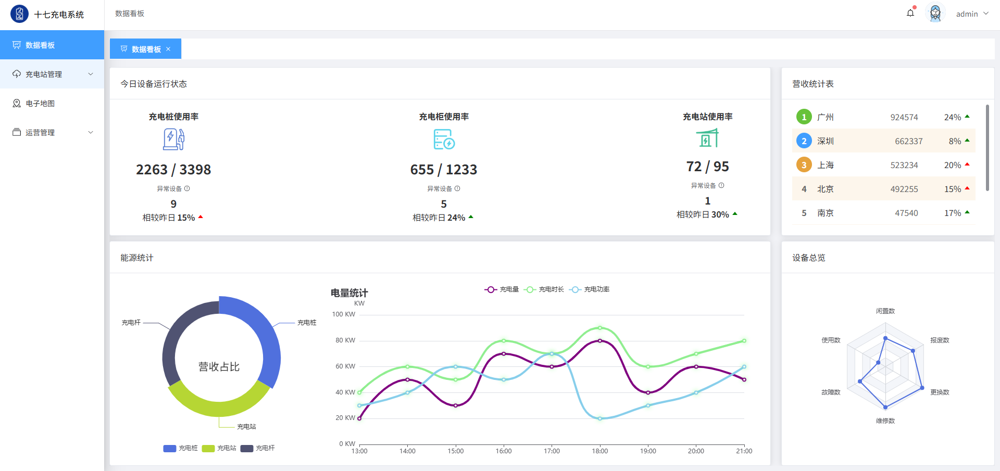
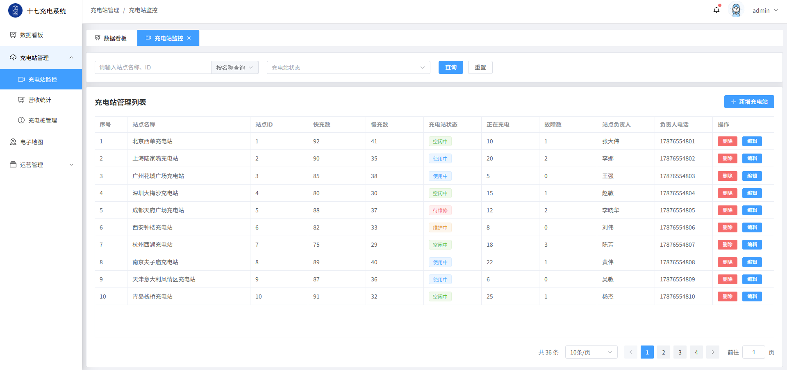
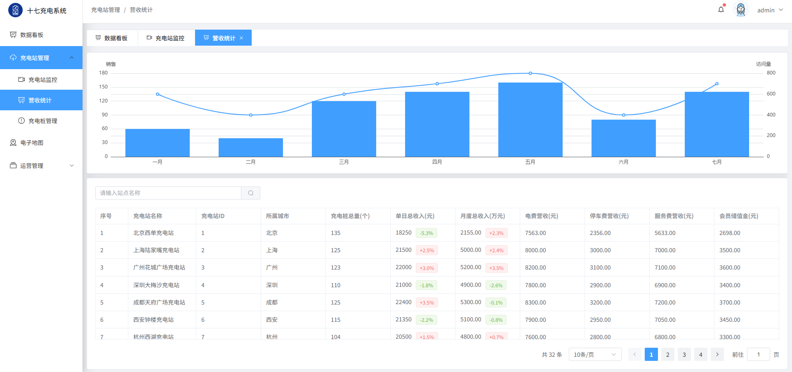
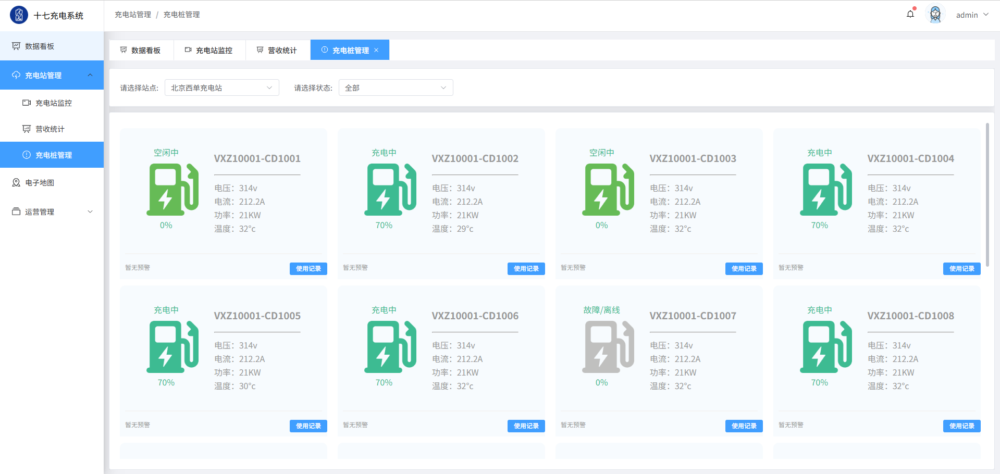
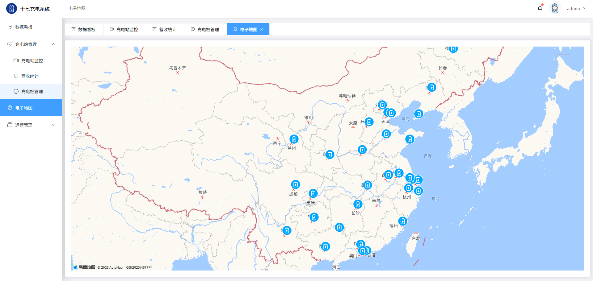
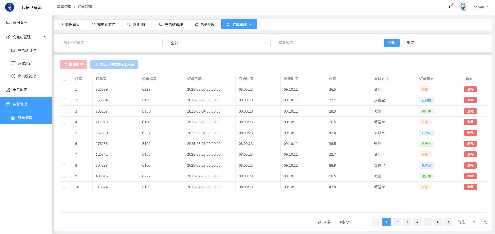

# 充电战管理系统

基于 Vue 3 + TypeScript 开发的充电站运营管理后台系统，主要用于充电站、充电桩、订单及运营数据的管理与可视化展示。

## 技术栈

- Vue 3
- TypeScript
- Vite
- Element Plus
- Pinia
- Vue Router
- Axios
- ECharts
- 高德地图

## 功能模块

- 登录
- 数据看板
- 充电站监控
- 营收统计
- 充电桩管理
- 电子地图
- 订单管理

## 核心功能

- 动态路由及路由权限控制
- Pinia 状态管理
- Tabs 多页签切换
- 面包屑导航
- Axios 请求封装及拦截器
- ECharts 数据可视化
- 高德地图及充电站点位展示
- 公共表格及分页组件封装
- 接口数据动态渲染

## 项目预览

### 登录


### 数据看板



### 充电站监控



### 营收统计



### 充电桩管理



### 电子地图



### 订单管理



## 运行项目

```bash
npm install
npm run dev
```
